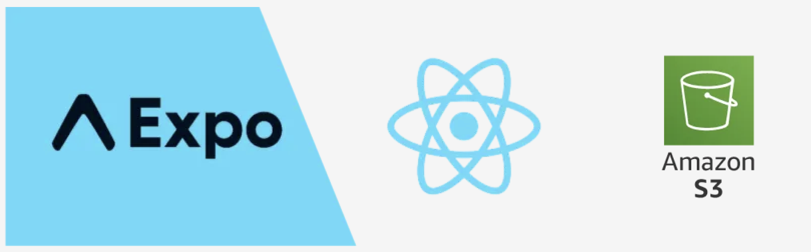

# 📱iOS React Native (Expo) Filestore with AWS S3 Bucket

This is a boilerplate for [React Native](https://reactnative.dev/) with [Expo v.49](https://docs.expo.dev/) demonstrating how to organize upload, download, and delete files from your AWS S3 Bucket. It's tailored for iOS applications and utilizes the modern React Native framework.



## Getting Started
#### Prerequisites
Before diving into the project, ensure you have set up your development environment. This includes installing [Xcode](https://developer.apple.com/xcode/) for iOS devs and other essential tools for React Native development.

Register an account with AWS and set up an S3 Bucket. Fill in your credentials in the `.env` file as follows:

```env
EXPO_PUBLIC_REGION=
EXPO_PUBLIC_ACCESS_KEY=
EXPO_PUBLIC_SECRET_ACCESS_KEY=
EXPO_PUBLIC_BUCKET_NAME=
```

**Running the Development Server**

```zsh
npm i
npm run ios 
```

**Features**
🗳️ Upload files to S3 using `DocumentPicker` and `ImagePicker`  
📂 Download files from S3  
❌ Delete files from S3  

⭐️ Feel free to contribute to this project by submitting issues, pull requests, or providing feedback.

## ⚠️ Attention!

This is a boilerplate designed for direct operations from a mobile application with AWS services, specifically the S3 Bucket. While this approach provides flexibility, please be aware that storing credentials within the mobile app can be insecure. It may expose sensitive information to malicious users. Always follow best practices for security and consider using server-side operations or AWS Identity and Access Management (IAM) roles to handle credentials and sensitive operations.